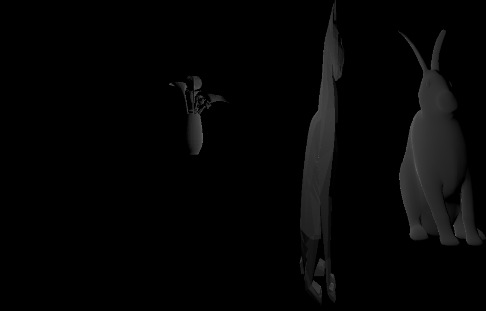

# CMPM163Labs
# lab2
https://drive.google.com/file/d/12DoIAUwxjA3S5v6kXFAolX56LEjBQwrB/view?usp=sharing

# lab3
https://drive.google.com/file/d/1M1bQ4KmG0x3MTsf7-NDkKLmH6Y2tH6d_/view?usp=sharing
Cube 1: Made using a wireframe material in color facade.  
Cube 2: Made using a phong material given to me.  
Cube 3: I interpolated between blue and green using the given shader.  
Cube 4: I interpolated between black and pink using my own shaders.
