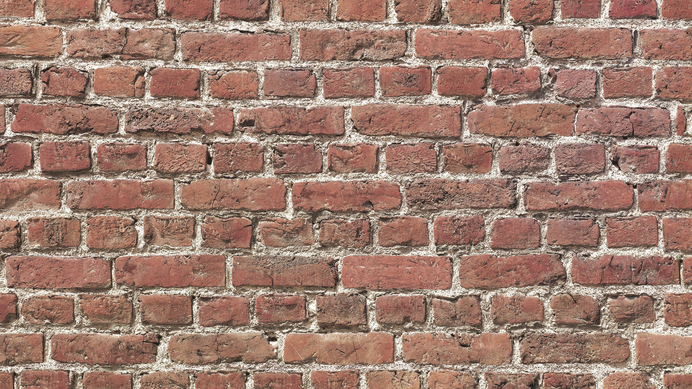
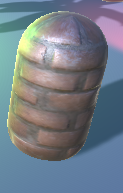

# CMPM163Labs
# lab2
https://drive.google.com/file/d/12DoIAUwxjA3S5v6kXFAolX56LEjBQwrB/view?usp=sharing

# lab3
https://drive.google.com/file/d/1M1bQ4KmG0x3MTsf7-NDkKLmH6Y2tH6d_/view?usp=sharing  
Cube 1: Made using a wireframe material in color facade.  
Cube 2: Made using a phong material given to me.  
Cube 3: I interpolated between blue and green using the given shader.  
Cube 4: I interpolated between black and pink using my own shaders.

# lab4  
https://drive.google.com/file/d/13s9oFEs7gKaxh5ZbuefVHjHTW8mJUkL8/view?usp=sharing  
Cube 1: Made using a simple rocky texture map.  
Cube 2: Made using a rocky texture map as well as a corresponding matching normal map.  
Cube 3: Made using a red/pink texture map with its matching normal map.  
Cube 4: Made using a texture loaded in through my fragment shader.  
Cube 5: Made by using conditionals in the fragment shader to create four different subsections in the texture for each quadrant.  
  
24a) x = floor(8u - u)  
24b) y = 8 - 8u  
24c) gray  

# lab5  
https://drive.google.com/file/d/1_z3Gs9Z0r2Bem8dsNrc4B6OsJmdYCdKO/view?usp=sharing  
In this lab, I chose to do part 1, the game in Unity. I changed the skybox color to be a bright blue instead of the original purple   color. I then changed the material of the checkpoints to be more metallic and orange instead of purple as well. I manipulated some of   the prefabs to create a giant tree in the middle of the track as well as some obstacles along the track as well. I created yellow   particles by creating a new material for the particle system and also changed the kart's color as well.

# lab6
https://drive.google.com/file/d/1c7lRileKtDSNFD5e1I42w8icMIM0qN1D/view?usp=sharing  
   
A point light is a light that is located in a point in space and emits light in all directions equally.  
A spot light is a light with a range and specified location that emits light in a cone in a specific direction.  
A directional light does not have a specific location and exists as a sort of sun light infinitely far away that emits light in a single direction.  
An area light is a rectangle in space that only emits light from one side of the rectangle.  
  
The object I found in the real world was a brick wall. I created this material in Unity by looking for a normal map and texture map for a brick wall and applying it to a 3D capsule object.  

In my lab, I have added two addition textured objects: a palm tree and a garbage can.  

I have added a daytime skybox as well to my scene.
